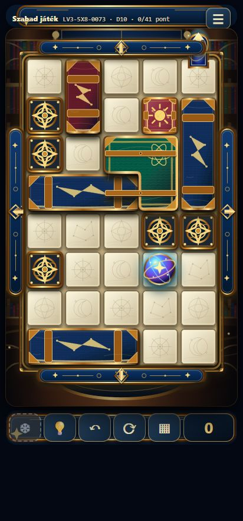
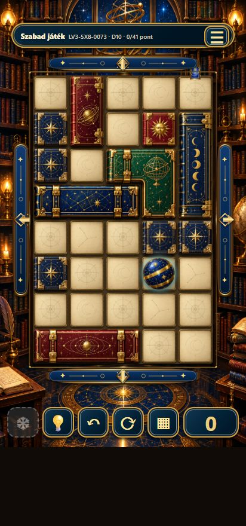

# Csillagkönyvtár – v0.15.21 vizuális átépítés

A korábbi egyszerű SVG-alakzatok nem adták vissza az elfogadott látványterv anyagait és részletességét. Az új téma különálló, átlátszó hátterű, illusztrált könyveket és gömböt használ. A játék mozgása, pályája és kattintható elemei továbbra is valódi játékobjektumok.

## Elemről elemre

| Elem | Új megjelenés |
|---|---|
| Környezet | Csillagos boltíves ablak, sárgaréz armillárium, könyvespolcok, mécsesek, gyertyák és asztal |
| Fix mezők | Sötétkék bőrkötés, nyolcágú szélrózsa, díszes arany sarokveretek |
| Egymezős mozgatható könyv | Bordó bőr és plasztikus arany naparc |
| 2V | Bordó kódex, armillárium-rajz, jobb oldali csatok és vastag könyvgerinc |
| 2H | Zöld bőrkódex arany armilláriummal |
| 3H | Stabil azonosító alapján kék csillagtérképes vagy bordó bolygópályás könyv; a referencia-pályán K6 kék, K9 bordó |
| 3V | Kék kódex, arany holdfázisok és csatok |
| L-alakok | Összefüggő zöld könyv, valóban átlátszó hiányzó negyeddel, négy tájolással |
| Golyó | Kék zománcgömb, arany csillagképek és sárgaréz pántok |
| Üres mezők | Textúrázott pergamen, szélrózsa-, hold- és csillagkép-változat |
| Kezelőfelület | Kék–arany fejléc és alsó gombok, a referencia szerint rövidebb oldalsó vezérlősávok |

## Valódi pályán ellenőrizve

Megnyitás: `?level=LV3-5X8-0073&theme=celestial-library`.

| Előtte – tényleges v0.15.20 | Utána – tényleges v0.15.21 |
|---|---|
|  |  |

[A 23 lépéses végigjátszás sikerablaka](celestial-library-playthrough.png).

- 412×880 és 360×800 telefonos nézet: teljes tábla és négy iránygomb látható, nincs vízszintes túlcsordulás.
- A pályát a négy valódi iránygombbal 23 lépésből sikeresen végigjátszottuk; a győzelmi képernyő 23 lépést és +41 pontot jelzett.
- A pályaadatok változatlanok. A nyolcadik sor és a valódi kijárat megmaradt.
- Az asset-, elrendezés-, keret-, variáns- és alakzatteszteket lefuttattuk. A korábbi statikus „99,4%” jellegű grafikai megfelelőségi állításokat eltávolítottuk; ilyen hasonlósági mérés nem történt.

## Megmaradó eltérések

Ez jelentős grafikai újraépítés, nem képpontra azonos reprodukció. Az elfogadott kép hét sort ábrázol, míg az LV3-5X8-0073 pálya nyolcsoros. A látványterv nem mutatja a valódi kijáratot. A generált könyvgrafikák a megadott motívumokat és anyagokat követik, de apró részleteik eltérnek. A pontszám a felhasználó böngészőjében tárolt valódi egyenleg marad.

## Képi források

A grafikák a beépített ImageGen eszközzel készültek a felhasználó elfogadott képéből. A közös utasítás: a megjelölt könyv vagy gömb önálló, ortografikus, valóban átlátszó hátterű játékassetként készüljön, a referencia bőrtextúráival, sárgaréz vereteivel és csillagászati motívumaival; ne legyen egyszerű vektoros ikon, felirat vagy beleégetett pályaháttér. A háttér utasítása: a könyvtár újrarajzolása a teljes játéktábla és kezelőfelület nélkül. A pergamen-változatoknál azonos anyag és keret mellett csak a finom vonalrajz változzon.

A raszterek WebP-tömörítéssel, az átlátszóság megőrzésével kerültek önálló SVG-konténerekbe. A viewBox csak az átlátszó margókat igazítja a játékmezőhöz; nincs közös atlasz vagy a teljes pályát helyettesítő kép. A négy L-alak ugyanannak a textúrának a tájolása, a hiányzó negyed átlátszó marad.
